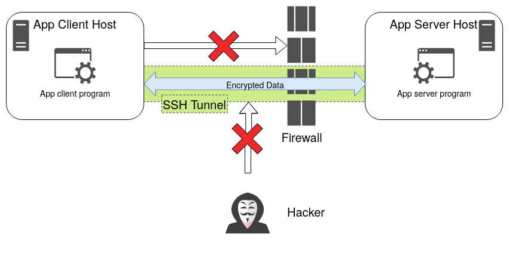
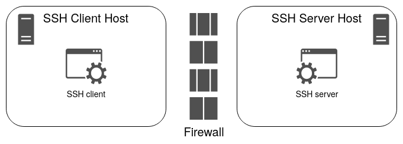
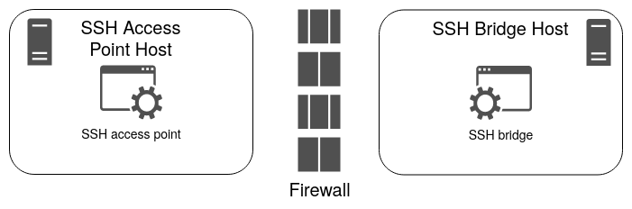
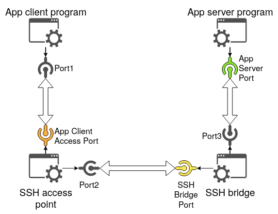
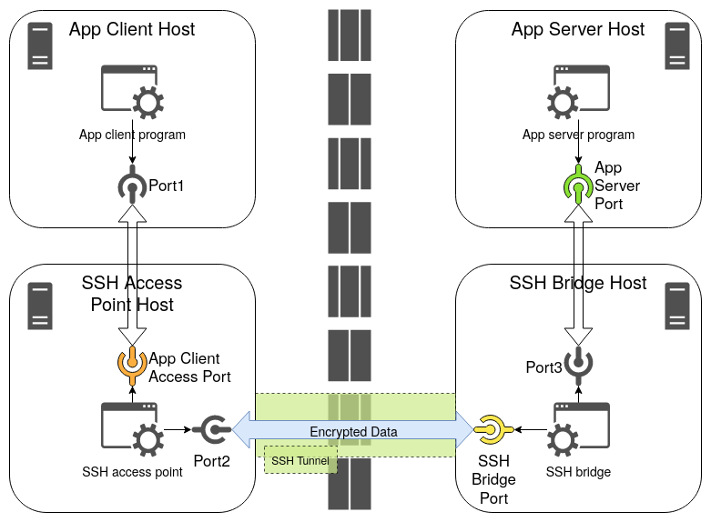
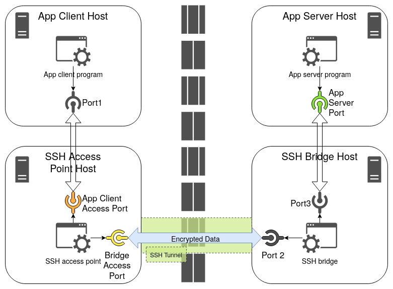
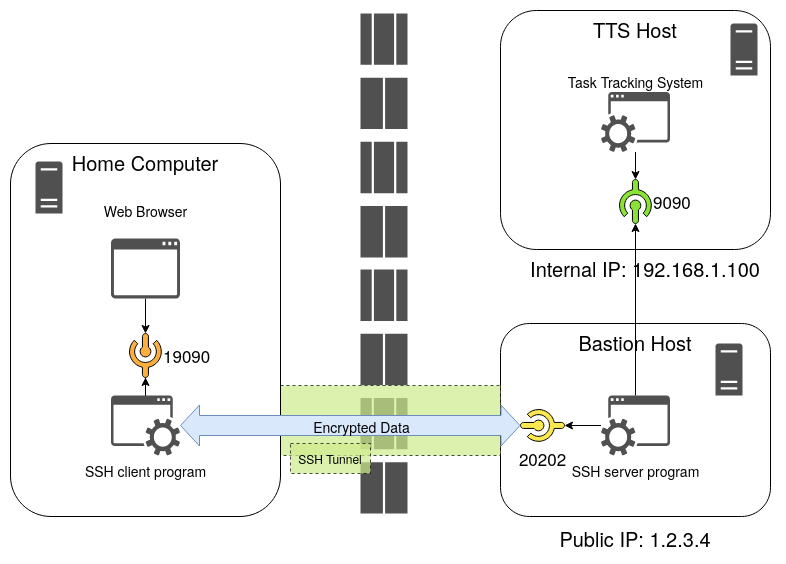
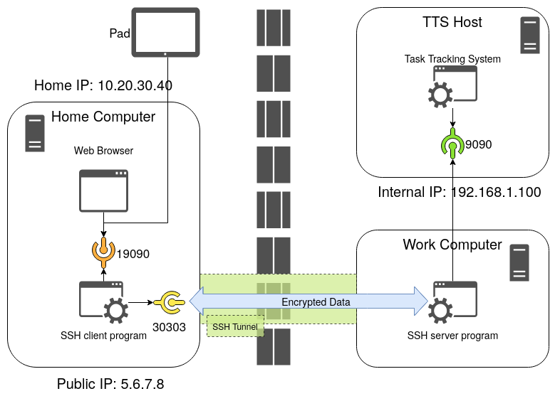

# SSH Tunneling Explained

> Understanding SSH tunneling is not difficult; understanding it via confusing tutorials is difficult.

## 1. Introduction

### 1.1 Target audience

This article targets the readers who **already have some experience in SSH but have little experience in SSH tunnels**, and who are looking for an article that can give them a clear overview as well as detailed command-line instructions. Because of this, this article explains the topic in a step-by-step manner in a slow pace. Those who already have some experience in SSH tunnels may find the article pace too cumbersome and is "not into the topic immediately".

### 1.2 Confusing tutorials

I wrote this article because I was one of the target readers before. I read a few online tutorials or chapters of books about SSH tunneling when I was learning it. Unfortunately, the ones I used were too confusing for me to understand. In my mind, _ideally_, a well written tutorial should use clearly defined terms to explain the topic so the readers don't not have to do experiments on their own in order to figure out what the tutorial actually means, as [4] says:

> Even though there are many articles on the subject still it took me a considerable amount of googling, some experimenting and couple of `Wireshark` sessions to grasp what's going under the hood. Most of the guides were incomplete in terms of explaining the concept which left me desiring for a good article on the subject with some explanatory illustrations.

I agree with the author. In fact, I used three references ([1], [2], [3]) that all seem to be authoritative but I still failed to understand the topic by reading them. [3] gave me a strong clue that eventually helped me understand the topic after reading [4].

That was the main motive I decided to write such an article by myself.

### 1.3. Obstacles to understanding

I think the biggest obstacles are the unclear use of the terms of "local" and "remote" and the mismatching of these two words against the given example commands which may use "localhost" that may not be clear to the readers whether it refers to the localhost of "local" or "remote".

For example, the section _9.2.1 Local Forwarding_ in [1] says:

> In our earlier example, we had an IMAP server running on machine S, and an email reader on home machine H, ... The
following command then creates the tunnel:
>
> `$ ssh -L2001:localhost:143 S`
>
> The `-L` option specifies local forwarding, in which the TCP client is on the local machine with the SSH client. The
option is followed by three values separated by colons: a local port to listen on (2001), the remote machine name or IP
address (S), and the remote, target port number (143).

I was immediately confused: if the address in the middle is "the remote machine name or IP address (S)" as the last paragraph says, why is it `localhost` in the given command line? Why is it not `-L2001:S:143`? For a moment, I thought either the example command has a typo or the last paragraph is wrong about the address in the middle. So I consulted [2] but, unfortunately, didn't help me very much, either:

> Specifies that connections to the given TCP port or Unix socket on the local (client) host are to be forwarded to the given host and port, or Unix socket, on the remote side.  This works by allocating a socket to listen to either a TCP port on the local side, optionally bound to the specified `bind_address`, or to a Unix socket. Whenever a connection is made to the local port or socket, the connection is forwarded over the secure channel, and a connection is made to either host port `hostport`, or the Unix socket `remote_socket`, from the remote machine.

This paragraph says "forwarded to the given host and port" but doesn't explain the relationship between this "given host" and the "remote side". As a result, I still didn't understand what this "given host" refers to exactly.

To be fair, when I re-read these paragraphs after I finally understand how SSH tunneling works, I don't think they explain anything incorrectly: the paragraphs all make sense to me now. However, I still don't think they explain the topic in a novice-friendly way which causes the beginners to scratch their heads a lot.

### 1.4. My approach to explaining

In this article, I am using a bottom-up approach to explain SSH tunneling.

First of all, in Section 2, I'm going to briefly talk about the prerequisites that the readers need to know in order to understand SSH tunneling better.

In Section 3, I'm going to give the readers an overview of all the entire SSH tunneling technology to help the readers see what are involved in creating an SSH tunnel, so the readers will have a clear map of where we are.

In Section 4, I'm going to talk about the two methods of creating an SSH tunnel, local port forwarding and remote port forwarding, as well as the conditions that they can be used.

Section 5 and Section 6 discuss local port forwarding and remote port forwarding further, to explain the thought process when creating an SSH tunnel so the readers can learn what aspects to think about when they need to create an SSH tunnel. Each section also presents an concrete example.

Section 7 describes the simple lab I built using Vagrant and VirtualBox that the readers can use to experiement with SSH tunneling.

Section 8 discusses the security consideration when using SSH tunnels. Security always deserves some consideration.

### 1.5 Machines and hosts

Personally, I usually use the term "machine" to refer to physical machines. If I want to describe a "virtual machine", I'll just use "virtual machine". I use "host" as a more abstract term when it doesn't matter whether the machine is physical or virtual.

## 2. Prerequisites

Understanding of following technical topics is needed to understand SSH tunneling.

### 2.1 Socket binding

TCP/IP communication uses sockets. On the server side, after a socket is created (via [`socket(2)`](https://manpages.ubuntu.com/manpages/jammy/man2/socket.2.html)), it needs to be bound to an IP address so the clients can use this IP address to connect to the server program. This is done by calling [`bind(2)`](https://manpages.ubuntu.com/manpages/jammy/man2/bind.2.html).

Usually, a socket can be bound to only one IP address. For example, the server host may have multiple IP addresses:
- `127.0.0.1/8`: The host's loopback address that always exists.
- `192.168.1.50/24`: The IP address on the network `192.168.1.0/24`.
- `10.1.2.2/24`: The IP address on the network `10.1.2.0/24`.

If the server program's socket is bound to loopback address `127.0.0.1/8`, then only the other programs running on the same host can connect to the server program. The hosts on the networks `192.168.1.0/24` and `10.1.2.0/24` can't connect to it.

If the server program's socket is bound to `192.168.1.50/24`, then the other hosts on the network `192.168.1.0/24` can connect to the server program using the address `192.168.1.50/24`, but the hosts on the network `10.1.0.0/24` cannot connect to the server program because the address `192.168.1.50/24` is not accessible to them. The other programs running on the server host can still connect to the server program via the loopback address, though.

If the server program's socket is bound to `10.1.2.2/24`, then the other hosts on the network `10.1.0.0/24` can connect to the server program using the address `10.1.2.2/24`, but the hosts on the network `192.168.1.0/24` cannot connect to the server program because the address `10.1.2.2/24` is not accessible to them. The other programs running on the server host can still connect to the server program via the loopback address, though.

But the socket can also be bound to "any address" (using `INADDR_ANY` as explained in [`ip(7)`](https://manpages.ubuntu.com/manpages/jammy/man7/ip.7.html)). In this case, the server program can be connected via any available IP addresses (i.e., `127.0.0.1/8`, `192.168.1.50/24`, and `10.1.2.2/24` in the example above). The "any address" binding can be denoted using `*` or `0.0.0.0`.

Later we will use socket binding to determine the accessibility of the SSH tunnel from the application client perspective.

## 3. SSH tunneling overview

This section provides an overview of all the parts that get involved in SSH tunneling.

### 3.1 Purposes of SSH tunneling

We want to create an SSH tunnel for two purposes:

1. **Accessibility**: When a network service is not directly accessible from its client, we may want to create an SSH tunnel to gain the access. For example, a web service is deployed on the internal network of your company and the firewall blocks almost all the incoming traffic so you can't directly access the web service when you are working from home. However, if the firewall allows SSH communication, we can create an SSH tunnel to gain the access.

2. **Security**: When a service is accessible but the communication between the service and the client is insecure (e.g., using HTTP instead of HTTPS), we can create an SSH tunnel to secure the communication because an SSH tunnel encrypts the transferred data.

The following figure (Figure 1) illustrates the purposes:



### 3.2 Why called "SSH tunnel"?

"SSH tunnels" are called so for two reasons:
- 1). Conceptually, it looks like a real-world tunnel that drills through the obstacle (e.g., a mountain) that connects the two sides of the obstacle.
- 2). It uses SSH to build the tunnel.

### 3.3 SSH programs

Because SSH is of a server-client structure, and because SSH tunneling uses SSH, an _SSH server program_ and an _SSH client program_ are naturally involved. The SSH server program and the SSH client program are running on two hosts that are on the two ends of the SSH tunnel.

When it comes to SSH tunneling, the SSH server program and the SSH client program always run on two different hosts because if they run on the same host, there is no obstacle to overcome so there is no need to use an SSH tunnel.

The SSH server program and the SSH client program have their own configuration files. On a Ubuntu system, they are `/etc/ssh/sshd_config` and `/etc/ssh/ssh_config`, respectively. The configuration can affect the SSH communication behaviors.

Later we will talk about the "roles" that the SSH programs play. We prefer to use "roles" to discuss SSH tunneling because a role can be played by either the SSH server program or the SSH client program when using different methods of tunneling, so it's not always convenient to use SSH client program or SSH server program to talk about SSH tunneling.

The following figure (Figure 2) illustrates the SSH programs:



### 3.4 Application programs

As mentioned in the Section 2.1, we create an SSH tunnel in order to connect a service and its client program. Therefore, an application server program and its client program are also involved. They usually reside on different hosts, too.

### 3.5 SSH roles

Once an SSH tunnel is created, the application client program always directly accesses one SSH end of the tunnel in order to indirectly access the application server program. In this article, I call the role of this SSH end the **"SSH access point"**.

The SSH end on the other side of the tunnel works like a bridge that bridges the SSH tunnel and the application server program (so the data inside the tunnel can be sent to the application server program). In this article, I call the role of this SSH end the **"SSH bridge"**.

The following figure (Figure 3) illustrates the SSH roles:



### 3.6 Programs may not run on four hosts

Figure 1 and Figure 3 show that the application programs and SSH programs all run on their own hosts. In reality, this may not be always true. More likely, the application client program and the SSH access point are running on the same host, and the application server program and the SSH bridge are running on another host. But in this article, I still mainly deal with the most complicated case in which they all run on their own hosts.

### 3.7 TCP/IP communication

Essentially, the SSH client program, the SSH server program, the application server program, and the application client program all communicate via TCP/IP. Therefore, _IP addresses_ and _ports_ are involved.

An SSH tunnel involves three TCP/IP connections:

1. Between the application client program and the SSH client program.
2. Between the SSH client program and the SSH server program.
3. Between the SSH server program and the application server program.

Because every TCP/IP connection has two ends and because every end uses one port, totally six ports are involved. Among these six ports, three of them need our attention:

1. The port that the application server program listens to, i.e., the "App Server Port" in the diagram below.
2. The port that the SSH bridge listens to, i.e., the "SSH Bridge Port" in the diagram below.
3. The port that the SSH access point exposes for us to use to access the application server program, i.e., the "App Client Access Port".

The following figure (Figure 4) illustrates all the six ports:



Note that this figure only shows the case of local port forwarding which we will discuss shortly. In remote port forwarding, the ports between the SSH access point and the SSH bridge will be slightly different. We will show the difference when we discuss the remote port forwarding.

### 3.8 Big picture

Put all the elements together, what we have discussed above can be illustrated in the following figure (Figure 5):



Note that Figure 5 still only shows the case of local port forwarding.

## 4. SSH tunnling: two methods

There are two methods of creating an SSH tunnel: **local port forwarding** and **remote port forwarding**. The "local" and "remote" are said from the perspective of where the SSH tunnel is initiated.

If the user wants to create an SSH tunnel on one host (i.e., initiates an SSH tunnel from this host) and he/she wants to use the SSH tunnel on the same host, he/she will want to consider using local port forwarding, because the usage happens on the "local" area of the creation. In Figure 05, it is the user initiates the SSH tunnel on the SSH access point host and then uses the SSH tunnel on the application client host (which is on the local area of the SSH access point host). In this case, the SSH access point is the SSH client program and the SSH bridge is the SSH server program.

We can use this method when the SSH access point can access the SSH bridge via SSH. This implies:
- 1). The firewall on the SSH access point host does not block the outgoing SSH traffic.
- 2). The firewall on the SSH bridge host does not block the incoming SSH traffic.
- 3). The SSH bridge host has an IP address that the SSH access point host can access.

If the user wants to create an SSH tunnel on one host (i.e., initiates an SSH tunnel from this host) but he/she wants to use the SSH tunnel on the other host, he/she will want to consider using remote port forwarding, because the usage happens on the "remote" area of the creation. In Figure 5, it is the user initiates the SSH tunnel on the SSH bridge host but then uses the SSH tunnel on the application client host (which is on the remote area of the SSH bridge host). In this case, the SSH bridge is the SSH client program and the SSH access point is the SSH server program.

Because the SSH bridge is the SSH client program and the SSH access point is the SSH server program, when creating the SSH tunnel, we need to care about which port the SSH access point is listening to, i.e., the "Port 2" in Figure 5. Therefore, I modified Figure 5 slightly to get Figure 6 as follows:



We can use this method when the SSH bridge can access the SSH access point via SSH. This implies:
- 1). The firewall on the SSH bridge host does not block the outgoing SSH traffic.
- 2). The firewall on the SSH access point does not block the incoming SSH traffic.
- 3). The SSH access point host has an IP address that the SSH bridge host can access.

Oftentimes, the network configuration may allow both methods. But in some situations, the network configuration allows only one of them. Personally, I prefer to use local port forwarding whenever possible, because I can do all the setup work on one side and don't need to touch both sides. Suppose I am working from home and want to access an internal service in the office. Using local port forwarding, I can create the SSH tunnel at home. I don't need to go to the office or ask someone in the office to create the SSH tunnel for me. It's more convenient.

We will look at the two methods more closely in the next two sections.

## 5. Local port forwarding

### 5.1 Thought process

When you figure out that you want to use local port forwarding, you can follow the thought process below to determine all the details:
- Step 1: Standing at the position of the SSH access point, determine how to connect to the SSH bridge, including:
  - `ssh-bridge-ip`: The IP address of the SSH bridge host.
  - `ssh-bridge-port`: The port that SSH bridge is listening to.
  - `ssh-bridge-username`: The username to log in SSH bridge.
  - The credential (e.g., password or an X509 certificate) to authenticate the login.
- Step 2: Standing at the position of the application client host, determine how to access the SSH access point, including:
  - `app-client-access-ip`: The IP address of the SSH access point host. This is the address that's bound to the TCP/IP socket on the SSH access point for the application client programs to use.
    - For example, if the application client program and the SSH access point reside on the same host, the loopback address `127.0.0.1` may already be sufficient. If the two programs are running on different hosts, the public IP address of the SSH access point host needs to be used.
  - `app-client-access-port`: The port that SSH access point exposes for the application client program to use.
- Step 3: Standing at the position of the SSH bridge host, determine how to access the application server program, including:
  - `app-server-ip`: The IP address of the application server host.
    - For example, if the application server program and the SSH bridge reside on the same host, the loopback address `127.0.0.1` may already be sufficient. If the two programs are running on different hosts, the public IP address of the application server host needs to be used.
  - `app-server-port`: The port that the application server program is listening to.

Once these details are determined, we can run the following command on the **SSH access point host** to create the SSH tunnel:

```
ssh -L \
  <app-client-access-ip>:<app-client-access-port>:<app-server-ip>:<app-server-port> \
  -l <ssh-bridge-username> \
  -p <ssh-bridge-port> \
  <ssh-bridge-ip>
```

Then, on the application client program, we can access `<app-client-access-ip>:<app-client-access-port>` to indirectly access the application server program that's actually running on `<app-server-ip>:<app-server-port>`.

### 5.2 Example: Access the internal network via local port forwarding

Suppose your company has set up an internal network and has run a web-based task tracking system (TTS). When you are working from home, you may still want to access the TTS in order to get the status update from other team members as well as updating your own status. However, the TTS is not directly accessible from the outside of the world, but the company had also placed a bastion host that is accessible publicly over the Internet to allow working remotely.

Suppose you know that:
- You want to use the port `19090` on your home computer to access the TTS server.
- You want to access the TTS on your home computer and don't want other computers to use this connection.
- You have a user account called `ywen` to allow you to access the bastion host via SSH.
- The bastion host's public IP on the Internet is `1.2.3.4`.
- The SSH server on the bastion host listens to the port `20202`.
- The TTS host's IP is `192.168.1.100` and the TTS exposes its service via the port `9090`.

Therefore, you can set up an SSH local forwarding with the following command:

```
ssh -L \
  localhost:19090:192.168.1.100:9090 \
  -l ywen \
  -p 20202 \
  1.2.3.4
```

Generally speaking, this command is saying "I want to access the TTS service using `localhost:19090` on my home computer. To do that, I'll need the SSH server that's running on `1.2.3.4` at the port `20202` to help me forward the traffic to `192.168.1.100:9090`."

The following figure (Figure 7) illustrate the example:



### 5.3 Socket binding and accessibility

For the SSH access point, if its socket binds to different IP addresses, then it has different accessiblity by the application client programs:

- If it uses `localhost:19090` to create the SSH tunnel, then only the programs running on the SSH access point host can access the SSH tunnel via `localhost:19090`. In other words, `localhost` only supports the case that the application client program and the SSH access point are running on the same host.
- Suppose the SSH access point host has the IP address `10.20.30.40` in the home network. If it uses `10.20.30.40:19090` to create the SSH tunnel, then the SSH tunnel is only accessible via `10.20.30.40:19090`. The application client programs running on other hosts can use `10.20.30.40:19090` to access the SSH tunnel, but the programs running locally on the SSH access point host have to use `10.20.30.40:19090` to access the tunnel as well.
- If it uses `*:19090` or `0.0.0.0:19090` to create the tunnel, then the tunnel is accessible via both `localhost` and `10.20.30.40`.

## 6. Remote port forwarding

### 6.1 `GatewayPorts`

In local port forwarding, we can specify `app-client-access-ip` to determine which address the application client program uses. In remote port forwarding, by default, the `app-client-access-ip` is always the loopback address `127.0.0.1/8`. In other words, after the SSH tunnel is created using remote port forwarding, the application client program has to use `127.0.0.1/8` to access it, so it only supports the case that the application client program and the SSH access point are on the same host.

This restriction can be removed by enabling the `GatewayPorts` option of SSH access point. In remote port forwarding, the SSH server program plays the role of SSH access point, so we need to modify the SSH server program configuration. See [`sshd_config(5)`](https://manpages.ubuntu.com/manpages/jammy/man5/sshd_config.5.html).

Once `GatewayPorts` is enabled, the SSH tunnel that's created by remote port forwarding can be accessed via both the loopback address `127.0.0.1/8` as well as the other addresses, such as the `10.20.30.40` in the example below.

### 6.2 Thought process

When you figure out that you want to use remote port forwarding, you can follow the thought process below to determine all the details:
- Step 1: Standing at the position of the SSH bridge, determine how to connect to the SSH access point, including:
  - `bridge-access-ip`: The IP address of the SSH access point host that the SSH bridge can use.
  - `bridge-access-port`: The port that SSH access point is listening to so the SSH bridge can use.
  - `ssh-access-username`: The username that the SSH bridge can use to log in SSH access point.
  - The credential (e.g., password or an X509 certificate) to authenticate the login.
- Step 2: Standing at the position of the application client host, determine how to access the SSH access point, including:
  - `app-client-access-ip`: The IP address of the SSH access point host.
    - For example, if the application client program and the SSH access point reside on the same host, the loopback address `127.0.0.1` may already be sufficient. If the two programs are running on different hosts, the public IP address of the SSH access point host needs to be used.
  - `app-client-access-port`: The port that SSH access point exposes for the application client program to use.
- Step 3: Standing at the position of the SSH bridge host, determine how to access the application server program, including:
  - `app-server-ip`: The IP address of the application server host.
    - For example, if the application server program and the SSH bridge reside on the same host, the loopback address `127.0.0.1` may already be sufficient. If the two programs are running on different hosts, the public IP address of the application server host needs to be used.
  - `app-server-port`: The port that the application server program is listening to.

Once these details are determined, we can run the following command on the **SSH bridge host** to create the SSH tunnel (assuming `GatewayPorts` is enabled):

```
ssh -R \
  <app-client-access-ip>:<app-client-access-port>:<app-server-ip>:<app-server-port> \
  -l <ssh-access-username> \
  -p <bridge-access-port> \
  <bridge-access-ip>
```

Then, on the application client program, we can access `<app-client-access-ip>:<app-client-access-port>` to indirectly access the application server program that's actually running on `<app-server-ip>:<app-server-port>`.

### 6.3 Example: Access the internal network via remote forwarding

Suppose that the internal network in your company has the firewall rules that block all incoming traffic, and there is no bastion host set up to allow remote access from the outside. But the firewall rules don't block outgoing traffic from within the internal network. In order to use the TTS service in the internal network when you are working from home, you'll need to know the public IP address of your home computer. You will also need a work computer which is on the company's internal network and from which you will initiate a remote forwarding tunnel.

Suppose you know that:
- You want to use the port `19090` on your home computer to access the TTS server.
- You want to access the TTS on your home computer. However, you also want to access the TTS from your other devices such as the cellphone or pad.
- Your home computer's IP address on the home network is `10.20.30.40`.
- The user account name on your home computer is called `ywen-home`.
- Your home computer's public IP address on the Internet is `5.6.7.8`.
- The SSH server program on your home computer listens to the port `30303`.
- The TTS host's IP is `192.168.1.100` and the TTS exposes its service via the port `9090`.

You can run the following command on your work computer inside the company's internal network (assuming `GatewayPorts` is enabled):

```
ssh -R \
  10.20.30.40:19090:192.168.1.100:9090 \
  -l ywen-home \
  -p 30303 \
  5.6.7.8
```

On the home computer or the pad, one can access the TTS via `https://10.20.30.40:19090`. However, as I said in Section 6.1, once `GatewayPorts` is enabled, the SSH tunnel can be accessed via all the available addresses of the SSH access point host. Therefore, the command can be re-written as `ssh -R 19090:192.168.1.100:9090 ...`. The `<app-client-access-ip>` part is completely dropped.



## 7. SSH tunneling lab

I built a simple lab to help test how SSH tunnels are created and used. The `Vagrantfile` can be launched using [`vagrant`](https://www.vagrantup.com/). It uses VirtualBox as the hypervisor provider.

The `Vagrantfile` uses three hard-coded VirtualBox networks: `vboxnet0` (`192.168.56.0/24`), `vboxnet1` (`192.168.57.0/24`), and `vboxnet2` (`192.168.58.0/24`). The readers can either create these networks in their VirtualBox, or modify `Vagrantfile` to use the networks that VirtualBox has already created. On VirtualBox 7.0, the networks configuration can be found through "File" -> "Tools" -> "Network Manager".

`Vagrantfile` sets up four virtual machines: `app-client`, `ssh-access-point`, `ssh-bridge`, and `app-server`. The Ansible playbooks in the sub-directory `ansible` are used to automatically configure the virtual machines to an initial state:
- `app-client`:
  - IP address: `192.168.56.10` (in the same network with `ssh-access-point`)
  - Installed with `curl` to use as the application client program.
- `ssh-access-point`:
  - IP address: `192.168.56.20` (in the same network with `app-client`)
  - IP address: `192.168.57.100` (in the same network with `ssh-bridge`)
  - Installed with `openssh-server` and `openssh-client`.
  - SSH password authentication is enabled.
  - SSH server program listens to the default port `22`.
  - `GatewayPorts` is disabled.
- `ssh-bridge`:
  - IP address: `192.168.57.101` (in the same network with `ssh-access-point`)
  - IP address: `192.168.58.111` (in the same network with `app-server`)
  - Installed with `openssh-server` and `openssh-client`.
  - SSH password authentication is enabled.
  - SSH server program listens to the default port `22`.
  - `GatewayPorts` is disabled.
- `app-server`:
  - IP address: `192.168.58.222` (in the same network with `ssh-bridge`)
  - Installed with `curl`, in case this is needed.
  - Installed with Apache 2 to be used as the server program.

## 8. Security Considerations

SSH tunnels are a powerful tool, but power comes with responsibility, especially when it comes to security. We need to always consider the security implications when using SSH tunnels, because if misused, the SSH tunnels can become the tool of hacking. See incidents such as [this](https://www.bleepingcomputer.com/news/security/milkydoor-android-malware-uses-ssh-tunnels-to-access-secure-corporate-networks/), [this](https://venafi.com/blog/fox-kitten-espionage-campaign-used-ssh-tunneling-achieve-its-goals/), and [this](https://www.rackaid.com/blog/spam-ssh-tunnel/).

If the main motivate of creating an SSH tunnel is to bypass the firewall in order to gain the access to some service behind the firewall, one should always consider this as a suspicious (if not bad) practice. Firewall is there to block potential attacks, and bypassing it completely defeats the goal of setting up the firewall in the first place. Try hard to see if there are other ways to achieve the original purposes of using SSH tunnels.

If creating an SSH tunnel is really needed, then try to restrict the access and capabilities as much as possible. This way, only the people who can access the SSH access point host will have access to the SSH tunnel, making the attacking surface smaller. For example:
- Try to bind only the loopback address on the SSH access point host so the SSH tunnel is not publickly accessible to the hosts outside the SSH access point host.
- Avoid using the option `-g` that allows "remote hosts to connect to local forwarded ports" (see [2]).
- Use the option `-N` to restrict the SSH tunnel for port forwarding only (see [2]).

One also needs to think about the application server program. Because it is exposed to the outside, its vulnerabilities are exposed, too. A hacker may exploit these vulnerabilities to launch attacks. So make sure the application server program is patched with the latest security fixes.

[5] is a good article that talks more about the risk mitigation on SSH tunnels.

## References

- [1] [SSH, The Secure Shell: The Definitive Guide (Second Edition)](https://www.amazon.com/SSH-Secure-Shell-Definitive-Guide/dp/0596008953)
- [2] [ssh(1)](https://manpages.ubuntu.com/manpages/jammy/man1/ssh.1.html)
- [3] [SSH port forwarding - Example, command, server config](https://www.ssh.com/academy/ssh/tunneling/example)
- [4] [SSH Tunneling Explained](https://chamibuddhika.wordpress.com/2012/03/21/ssh-tunnelling-explained/)
- [5] [Mitigating Port-Forwarding Risk](https://www.informit.com/articles/article.aspx?p=602977)
